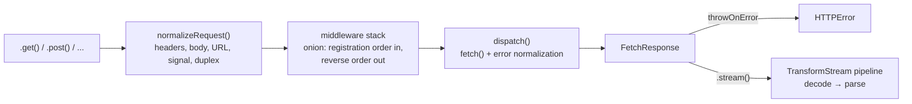

# Architecture

How fetch-rig is put together, for anyone maintaining or extending it. For what the package is
and why it's shaped this way, see [CONCEPT.md](CONCEPT.md). For usage, see the [README](../README.md).

## Pipeline overview



The request path is a **middleware chain**; response streaming is a separate **`TransformStream`
chain**. They're different problems with different shapes — middleware needs to re-run the rest
of the chain an arbitrary number of times (retry, auth-refresh), while streaming needs a consumer
that can walk away mid-read and still leave resources cleaned up — so each uses the composition
model suited to it, rather than forcing one abstraction to cover both.

## Request normalization order

Before the middleware stack runs, `normalizeRequest()` assembles the `Request` in a fixed order,
because the order affects the result:

1. **Merge headers** — instance `headers` → per-call `headers`, later wins.
2. **Auto-serialize the body** (see [below](#automatic-request-body-serialization)) — looks at the
   Content-Type from step 1 together with the body's type.
3. **Set `duplex: 'half'`** when the runtime supports it, regardless of body type.
4. **Build the URL** from `baseUrl` + `path` + `query`.
5. **Compose the abort signal** — per-call `signal` + `timeout`, via `AbortSignal.any()`. This
   composed signal stays identical across every retry attempt, so a user cancellation stops
   retries immediately too.
6. Construct the `Request`, build the `FetchContext`, enter the middleware stack.

## Middleware system

Middleware is a **function-wrapping model** — the same family as undici's `Dispatcher.compose()`
and Redux middleware — not Koa's single-use `next()` callback:

```typescript
type Dispatch = (ctx: FetchContext) => Promise<void>;
type FetchMiddleware = (next: Dispatch) => Dispatch;

function compose(middlewares: FetchMiddleware[], core: Dispatch): Dispatch {
  return middlewares.reduceRight<Dispatch>((next, mw) => mw(next), core);
}
```

`next` is a plain function reference, callable as many times as needed — retry and auth-refresh
both need to "run the rest of the chain more than once," which Koa's ctx+next model can't do
without recursive re-invocation. A runtime guard for "did you forget to `await next(ctx)`?" was
tried and removed: whether it fires turns out to depend on microtask-queue timing rather than
middleware structure, and it missed the common case where `next(ctx)` resolves near-instantly (a
mock in tests, a cache hit). That class of bug is a static-analysis problem — `eslint.config.js`
enables `@typescript-eslint/no-floating-promises`/`require-await` for it instead.

**Error normalization happens in the base `dispatch`** (the innermost layer, where `fetch()` is
actually called), not in `compose()`. When `fetch()` rejects, `dispatch` immediately normalizes
the error to `CanceledError`/`NetworkError`/`TimeoutError` based on `ctx.signal.aborted`, before
any middleware sees it. Normalizing any later — e.g. in the outermost layer — would break
`retry`'s `error instanceof CanceledError` check, since the error would still be a raw
`DOMException` by the time it got there.

### Built-in `retry`

Retry is not a special code path in `FetchInstance` — it's a middleware like any other, exported
for the caller to add to `middlewares` wherever they want it in the stack. There is no
config-level shortcut for it: an earlier version auto-injected `retry(options)` as the outermost
layer whenever `FetchConfig.retry` was set, but that only ever covered one fixed position — anyone
who needed retry elsewhere in the stack (e.g. *inside* an auth middleware, so token refresh wraps
the whole retry sequence) had to bypass it anyway. One explicit way to configure retry, reflecting
exactly what's running, replaced two.

Key implementation rules:

- **Clone before sending, not after failing.** By the time a send has failed, the body may
  already be disturbed — cloning must happen before the attempt, and is skipped entirely once no
  more retries are possible (avoiding the memory cost of `ReadableStream.tee()` buffering a stream
  that will never be reused).
- **`CanceledError` is never retried by default.** The default is
  `shouldRetry ? shouldRetry(...) : !(error instanceof CanceledError)` — a caller-supplied
  `shouldRetry` can override this, but the safe default respects an explicit user cancellation.
- **`Retry-After` is honored** (delay-seconds and the three legacy HTTP-date formats), and jitter
  is skipped when the server gave explicit timing — a deterministic server instruction wins over
  randomized backoff.
- **Per-call progress options apply only to the attempt actually being sent**, never to the spare
  clone held for the next retry — so progress never double-counts across retries.

## Cancellation, timeout, and progress

### Cancellation and timeout

Standard `AbortController`/`AbortSignal` only — no custom cancel-token class. A single `timeout`
option (ms) is supported at both the instance and per-call level; finer control (e.g. per-phase
timeouts) is left to composing your own `AbortSignal.timeout()` and passing it as `signal`. No
`AbortSignal.any()`/`AbortSignal.timeout()` polyfill is included — the minimum supported runtime,
Node 20+, has both natively.

### Upload/download progress

Progress is a **per-call option**, not a middleware — scoped to one request, not a cross-cutting
concern applied to every request through an instance.

A `TransformStream` wraps the body stream and accumulates transferred bytes (ported from ky's
progress-tracking algorithm), publishing each chunk's progress one tick delayed so the stream
can't report 100% before it's actually finished — `flush()` reports the true final chunk at
`progress: 1`. Each event also carries `rate`/`estimated`, a plain running average since the first
chunk rather than axios-style windowed smoothing: fully determined by `transferredBytes` and
elapsed time, at the cost of reacting slowly to a sudden mid-transfer speed change. The callback
parameter is conventionally named `event`, not `progress`, so `event.progress` doesn't stutter
against a parameter of the same name.

- **Download**: wraps `response.body`, estimates `total` from `Content-Length` (0 if absent).
- **Upload**: wraps `request.body` via `new Request(request, { duplex: 'half', body: withProgress(...) })`.
  `total` can't come from `Content-Length` — it's a forbidden request header, unreadable from a
  constructed `Request` — so `normalizeRequest()` computes it via `getSize()` right after
  serialization and threads it through as `FetchContext.uploadBytes`.

**Streaming a request body is a genuinely divergent capability across runtimes** — confirmed with
real Chrome and Firefox runs, not just Node:

| Runtime | Streamed upload (`duplex: 'half'`) |
| --- | --- |
| Chrome | Only over HTTP/2 (browsers negotiate HTTP/2 via TLS/ALPN) — fails before a single byte leaves the client on a plain HTTP/1.1 origin, `net::ERR_ALPN_NEGOTIATION_FAILED` |
| Firefox | Not supported at all — the body is sent unstreamed, silently |
| Node 20+ | Fully supported — this divergence never surfaces under `vitest` |

Requesting progress shouldn't be able to break the upload itself, so `dispatch.ts` applies a
narrow, safety-conscious fallback:

1. Before the streamed attempt, clone the request into an untouched `spare` (the same pattern
   `retry` uses).
2. `withUploadProgress()` takes an `onStart` hook — fired synchronously on the first chunk
   actually read, unlike the delayed `onProgress` callback, which can't distinguish "nothing sent
   yet" from "one chunk in."
3. If the streamed attempt fails **before `onStart` ever fired** (provably zero bytes left the
   client), retry once with `spare`, unstreamed — mirroring what Firefox already does natively.
   `onUpload` simply never fires for that call.
4. A failure **after** streaming has started is never retried — the server may have already
   received part of the body, and POST isn't safe to blindly retry (the same non-idempotent-retry
   principle `retry` applies by excluding POST from its default methods).

Net effect: on an HTTP/2 backend, progress works as expected. On an HTTP/1.1-only backend
(including most local dev setups), the upload still always succeeds — only the progress callback
goes silent.

### Response size limit (`maxDownloadBytes`)

A separate `TransformStream` stage (`withMaxSize`, piped in front of the progress-tracking one
when both are active) aborts the response body — throwing `TooLargeError` from whatever is
consuming it — once real received bytes exceed `maxDownloadBytes`. It never trusts the
`Content-Length` header to pre-empt the check, since that header can be absent or wrong, whether
by bug or by a hostile server; only bytes actually received count. It's checked immediately per
chunk, not through `withProgress`'s one-chunk-delayed accounting (fine for a progress percentage,
not precise enough for a safety limit meant to cap memory use).

Settable on `FetchConfig` (instance default) and overridable per-call via `RequestOptions`, the
same pattern as `timeout`/`throwOnError` — unlike `onUpload`/`onDownload` (inherently per-call), a
byte cap is a sensible blanket policy at the instance level too.

## Automatic request body serialization

`internals/body.ts` decides how to serialize a body by looking at **both the body's type and any
Content-Type already set** — not the body type alone:

| Body type | Existing Content-Type | Behavior |
| --- | --- | --- |
| `Blob` | (any) | passed through, Content-Type from `blob.type` |
| `ArrayBuffer`/typed array | (any) | passed through, `application/octet-stream` |
| `URLSearchParams` | (any) | `.toString()`, `application/x-www-form-urlencoded;charset=UTF-8` |
| `FormData` | (any) | passed through — Content-Type is **never** set manually (the runtime generates the multipart boundary) |
| `ReadableStream` | (any) | passed through, no Content-Type set |
| plain object | `application/x-www-form-urlencoded` | URL-encoded |
| plain object | `multipart/form-data` | converted to `FormData` |
| plain object | anything else/unset | JSON-serialized, after a strict "is this actually JSON-safe" check |
| string/number/boolean | (any) | passed through |

The JSON-safety check exists because `typeof value === "object"` alone isn't enough —
`JSON.stringify`-ing a `Map`/`Set`/arbitrary class instance can silently produce `"{}"`, quietly
losing data. It accepts arrays, plain `{}`-constructor objects, and anything with a `toJSON()`
method; it rejects typed arrays (duck-typed via a `buffer` property), `FormData`, and
`URLSearchParams`.

## Response streaming

`FetchResponse` wraps the native `Response`, adding `json<T>()`/`text()`/`arrayBuffer()`/
`bytes()`/`blob()`/`formData()` plus streaming methods. `FetchInstance.send()` throws `HTTPError`
for a non-2xx response when `throwOnError: true` — or, if `throwOnError` is a function, whenever
it returns `true` for the response's status, fully replacing the default 2xx check rather than
narrowing it.

### `TransformStream` chain architecture

All three streams (SSE, JSON Lines, plain text) are `TransformStream` subclasses, and there is
exactly **one** place in the entire library that ever holds a `ReadableStreamDefaultReader`
directly (`stream-iterator.ts`):

```typescript
async function* toIterator<T>(readable: ReadableStream<T>): AsyncGenerator<T> {
  const reader = readable.getReader();
  try {
    while (true) {
      const { done, value } = await reader.read();
      if (done) return;
      yield value;
    }
  } finally {
    await reader.cancel(); // not releaseLock() — propagates cancellation upstream
  }
}
```

Because `TransformStream` is a first-class citizen of the WHATWG Streams standard, a consumer
cancelling the stream (breaking a `for await` loop, an uncaught throw) propagates automatically
through the whole `pipeThrough()` chain back to the producer — ultimately `response.body`, and
from there the network connection itself. This is why streaming and progress-tracking use
`TransformStream` throughout rather than manual reader loops.

Progress wrapping (`withProgress`) is deliberately **not** applied to the `.stream()` pipeline —
combining byte-level `onDownload` with event-level `.stream()` consumption hasn't come up as a
real use case; revisit if it does.

### SSE stream

Implements the same line-streaming state machine as `eventsource-parser`: a leading BOM is
stripped for free by the pipeline's `TextDecoderStream` stage; `\n`/`\r`/`\r\n` line endings are
handled correctly even when split across chunk boundaries (shared with `TextLineStream` via
`internals/buffer-lines.ts`); an `id` field containing a NULL character is ignored per spec; a
`retry` field is only accepted if entirely ASCII digits (`/^\d+$/` — a naive `parseInt` +
`isNaN` check would wrongly accept `"10abc"` as `10`); and an internal buffer cap guards against
unbounded memory growth from a line that never terminates.

### JSON Lines stream

A character-level state machine tracks brace/bracket depth (string-literal contents and escapes
excluded from the count) to find complete JSON value boundaries. **Support is deliberately
NDJSON-only** — a value is emitted whenever depth returns to 0, so a response that's a single
top-level JSON array (`[{...},{...}]`) arrives as one value once the whole array has been
received; per-element streaming of a top-level array is out of scope. A value that fails
`JSON.parse()` is reported via `error` on the yielded `JsonStreamResponse` rather than a
stream-wide callback — the only one of the three formats with a real failure mode, so the field
lives on the value itself instead of a shared option that would silently no-op for SSE and text.

## URL and query construction

`internals/url.ts` builds the final URL via pure string joining (ufo's `joinURL` approach) rather
than `URL` objects, specifically so a relative `baseUrl` (e.g. `'/api'`) works identically in
Node/Workers as in a browser — `new URL()` can't construct from a relative base at all, but
`fetch()`/`Request` accept a plain string URL just fine. `buildUrl()` therefore returns a
`string`, not a `URL`.

Query arrays serialize as **repeated keys** (`key=v1&key=v2`, not `key[]=`/`key[0]=`), matching
ufo and axios's default (`indexes: false`).

## Error model

| Class | Thrown when | Notable fields |
| --- | --- | --- |
| `FetchError` | Base class, never thrown directly | — |
| `HTTPError` | `throwOnError: true` (or a `throwOnError` function returning `true`) for the response's status | `response`, `data` (pre-parsed body) |
| `NetworkError` | `fetch()` itself rejects | `cause` |
| `TimeoutError` | The `timeout` option elapses | `request` |
| `CanceledError` | An `AbortSignal` is aborted | `reason` (from `signal.reason`) |
| `TooLargeError` | Response body exceeds `maxDownloadBytes` | `maxDownloadBytes`, `transferredBytes` |

A `Response` body can only be read once. `HTTPError` needs `data` pre-parsed (so `error.data`
works synchronously) while leaving `error.response` fully re-readable afterward — so it reads from
`response.clone()` at construction time. Reading the body is inherently async, which a constructor
can't do, so `HTTPError` is built via `static async HTTPError.from(response, request)` rather than
`new HTTPError(...)` directly.

`throwOnError`'s function form intentionally inverts axios's `validateStatus` polarity: axios
returns `true` for "this is fine, don't throw," while fetch-rig's returns `true` for "throw for
this status" — matching what the boolean form of the same field already means (`throwOnError:
true` throws), rather than having the field mean opposite things depending on whether a `boolean`
or a `function` was passed.

## Security / network options scope

Only what the Fetch standard already provides is exposed (`redirect: 'follow' | 'manual' |
'error'`). Proxy configuration (a Node-only `undici` extension) and XSRF cookie handling (a
browser-only convention) are out of scope — see [CONCEPT.md](CONCEPT.md) for why.

## Module structure

| Module | Responsibility |
| --- | --- |
| `index.ts` | Public entry point — re-exports public classes/types |
| `FetchInstance.ts` | Middleware assembly, dispatch invocation, the `fr` default instance |
| `FetchResponse.ts` | Response wrapper — body parsing + streaming methods |
| `middleware/compose.ts` | Function-wrapping composition executor |
| `middleware/retry.ts` | Built-in retry middleware |
| `errors/*.ts` | `FetchError` hierarchy |
| `internals/url.ts` | `baseUrl`/`path`/`query` → URL string |
| `internals/body.ts` | Body auto-serialization + size estimation |
| `internals/duplex-support.ts` | Runtime streaming-upload feature detection |
| `internals/normalize-request.ts` | The 6-step request assembly above |
| `internals/dispatch.ts` | Innermost `Dispatch` — `fetch()` + error normalization + upload fallback |
| `internals/normalize-error.ts` | Normalizes an abort/fetch failure into a `FetchError` subclass |
| `internals/retry-after.ts` | `Retry-After` header parsing |
| `internals/progress.ts` | Upload/download progress `TransformStream`s |
| `internals/stream-iterator.ts` | The library's single reader-handling site |
| `internals/stream-format.ts` | Content-Type → stream format detection |
| `internals/buffer-lines.ts` | Shared line-buffering for SSE/text streams |
| `internals/sleep.ts` | Abortable delay, for retry backoff |
| `streams/*.ts` | `SseStream` / `JsonLineStream` / `TextLineStream` |
| `types/*.ts` | Public type definitions |

For test strategy, see [TESTING.md](TESTING.md).
